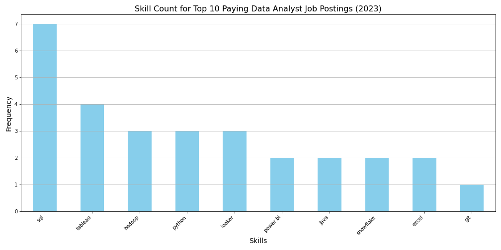

# Introduction
📊 Dive into the data job market! Focusing on data analyst roles, this project explores 💰 top-paying jobs, 🔥 in-demand skills, and 📈 where high demand meets high salary in data analytics.

🔍 SQL queries? Check them out here: [project_sql folder](/project_sql/)
# Background
Driven by a quest to navigate the data analyst job market more effectively, this project was born from a desire to pinpoint top-paid and in-demand skills, streamlining others work to find optimal jobs.

### The questions I wanted to answer through my SQL queries were:

1. What are the top-paying data analyst jobs?
2. What skills are required for these top-paying jobs?
3. What skills are most in demand for data analysts?
4. Which skills are associated with higher salaries?
5. What are the most optimal skills to learn?

# Tools I Used
For my deep dive into the data analyst job market, I harnessed the power of several key tools:

- **SQL:** The backbone of my analysis, allowing me to query the database and unearth critical insights.
- **PostgreSQL:** The chosen database management system, ideal for handling the job posting data.
- **Visual Studio Code:** My go-to for database management and executing SQL queries.
- **Git & GitHub:** Essential for version control and sharing my SQL scripts and analysis, ensuring collaboration and project tracking.

# The Analysis
Each query for this project aimed at investigating specific aspects of the data analyst job market. Here’s how I approached each question:

### 1. Top Paying Data Analyst Jobs
To identify the highest-paying roles, I filtered data analyst positions by average yearly salary and location, focusing on remote jobs. This query highlights the high paying opportunities in the field.
```sql
SELECT job_id, job_title, job_location, job_schedule_type, salary_year_avg, 
job_posted_date, name as company_name
FROM job_postings_fact p
JOIN company_dim c ON p.company_id = c.company_id
WHERE job_title_short = 'Data Analyst' AND job_location = 'Anywhere' 
AND salary_year_avg IS NOT NULL
ORDER BY salary_year_avg DESC
LIMIT 10;
```
Here's the breakdown of the top data analyst jobs in 2023:
- **Wide Salary Range:** Top 10 paying data analyst roles span from $184,000 to $650,000, indicating significant salary potential in the field.
- **Diverse Employers:** Companies like SmartAsset, Meta, and AT&T are among those offering high salaries, showing a broad interest across different industries.
- **Job Title Variety:** There's a high diversity in job titles, from Data Analyst to Director of Analytics, reflecting varied roles and specializations within data analytics.


*Bar graph visualizing the salary for the top 10 salaries for data analysts; ChatGPT generated this graph from my SQL query results*

### 2. Skills for Top Paying Jobs
To understand what skills are required for the top-paying jobs, I joined the job postings with the skills data, providing insights into what employers value for high-compensation roles.
```sql
WITH top_paying_jobs_cte AS (
    SELECT job_id, job_title, salary_year_avg, name as company_name
    FROM job_postings_fact p
    JOIN company_dim c ON p.company_id = c.company_id
    WHERE job_title_short = 'Data Analyst' AND job_location = 'Anywhere' 
    AND salary_year_avg IS NOT NULL
    ORDER BY salary_year_avg DESC
    LIMIT 10
)

SELECT sj.job_id, job_title, salary_year_avg, company_name, skills 
FROM top_paying_jobs_cte cte
JOIN skills_job_dim sj ON cte.job_id = sj.job_id
JOIN skills_dim s on sj.skill_id = s.skill_id
```
Here's an analysis of the skills required for the top 10 data analyst roles based on the job postings. 
Most Frequently Mentioned Skills:
- **SQL**: 7 mentions
- **Tableau**: 4 mentions
- **Hadoop**, **Python**, **Looker**: 3 mentions each
- Moderately Mentioned Skills:
**Power BI**, **Java**, **Snowflake**, **Excel**: 2 mentions each
- Less Frequently Mentioned Skills:
**Git**, **Confluence**, **Jira**, **Crystal**, **Databricks**, **Bitbucket**, **Atlassian**, **R**, **Flow**, **Scala**, **C++**, **Redshift**, **Oracle**, **Spark**, **Airflow**, **Azure**: 1 mention each

*Bar graph visualizing the count of skills for the top 10 paying jobs for data analysts; ChatGPT generated this graph from my SQL query results*

### 3. In-Demand Skills for Data Analysts

This query helped identify the skills most frequently requested in job postings, directing focus to areas with high demand.
```sql
SELECT skills, COUNT(sj.job_id) AS demand_count
FROM job_postings_fact p
JOIN skills_job_dim sj ON p.job_id = sj.job_id
JOIN skills_dim s on sj.skill_id = s.skill_id
WHERE job_title_short = 'Data Analyst'
AND job_work_from_home
GROUP BY skills
ORDER BY demand_count DESC
LIMIT 5
```
Here's the breakdown of the most demanded skills for data analysts in 2023
- **SQL** and **Excel** remain fundamental, emphasizing the need for strong foundational skills in data processing and spreadsheet manipulation.
- **Programming** and **Visualization Tools** like **Python**, **Tableau**, and **Power BI** are essential, pointing towards the increasing importance of technical skills in data storytelling and decision support.

| Skills   | Demand Count |
|----------|--------------|
| SQL      | 7291         |
| Excel    | 4611         |
| Python   | 4330         |
| Tableau  | 3745         |
| Power BI | 2609         |

*Table of the demand for the top 5 skills in data analyst job postings*

### 4. Skills Based on Salary
Exploring the average salaries associated with different skills revealed which skills are the highest paying.
```sql
SELECT skills, ROUND(AVG(salary_year_avg),0) AS avg_salary_per_skill
FROM job_postings_fact p
JOIN skills_job_dim sj ON p.job_id = sj.job_id
JOIN skills_dim s on sj.skill_id = s.skill_id
WHERE job_title_short = 'Data Analyst'
AND salary_year_avg IS NOT NULL
GROUP BY skills
ORDER BY avg_salary_per_skill DESC
LIMIT 25
```
Here's a breakdown of the results for top paying skills for Data Analysts:
- **High Demand for Big Data & ML Skills:** Top salaries are commanded by analysts skilled in big data technologies (PySpark, Couchbase), machine learning tools (DataRobot, Jupyter), and Python libraries (Pandas, NumPy), reflecting the industry's high valuation of data processing and predictive modeling capabilities.
- **Software Development & Deployment Proficiency:** Knowledge in development and deployment tools (GitLab, Kubernetes, Airflow) indicates a lucrative crossover between data analysis and engineering, with a premium on skills that facilitate automation and efficient data pipeline management.
- **Cloud Computing Expertise:** Familiarity with cloud and data engineering tools (Elasticsearch, Databricks, GCP) underscores the growing importance of cloud-based analytics environments, suggesting that cloud proficiency significantly boosts earning potential in data analytics.

| Skills        | Average Salary ($) |
|---------------|-------------------:|
| pyspark       |            208,172 |
| bitbucket     |            189,155 |
| couchbase     |            160,515 |
| watson        |            160,515 |
| datarobot     |            155,486 |
| gitlab        |            154,500 |
| swift         |            153,750 |
| jupyter       |            152,777 |
| pandas        |            151,821 |
| elasticsearch |            145,000 |

*Table of the average salary for the top 10 paying skills for data analysts*